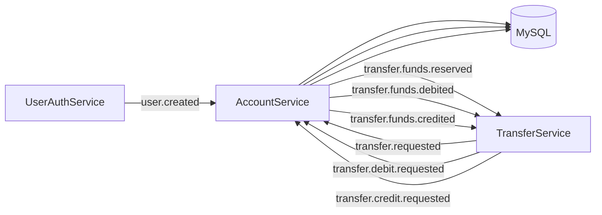
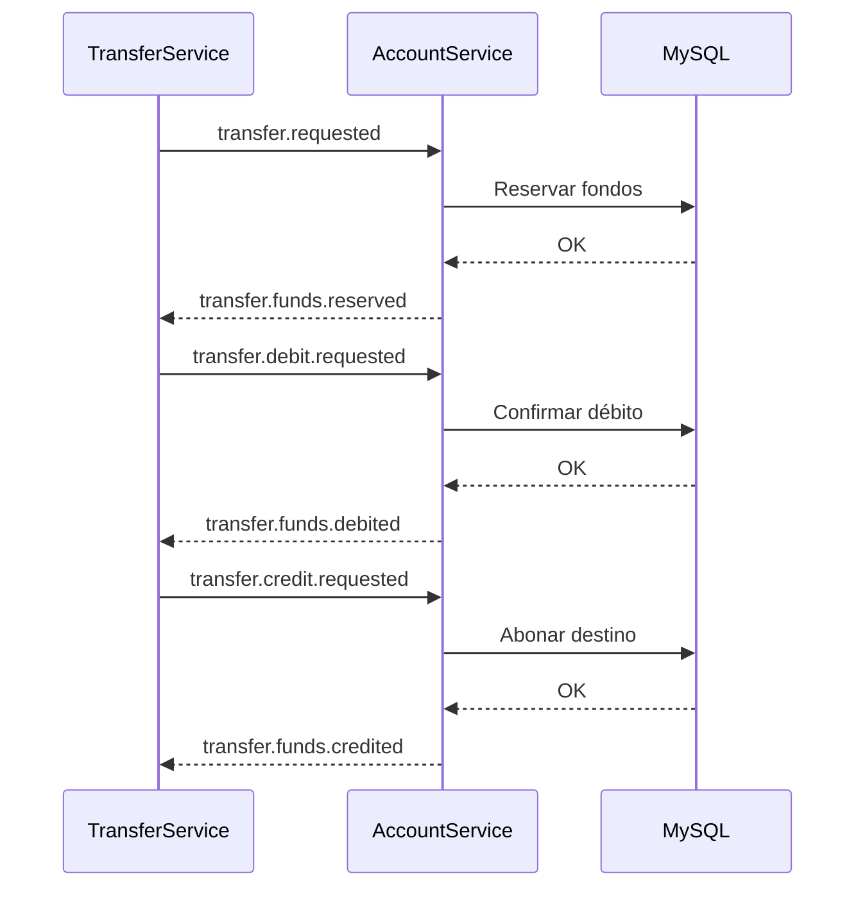
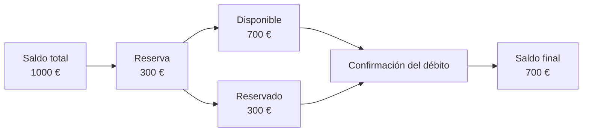
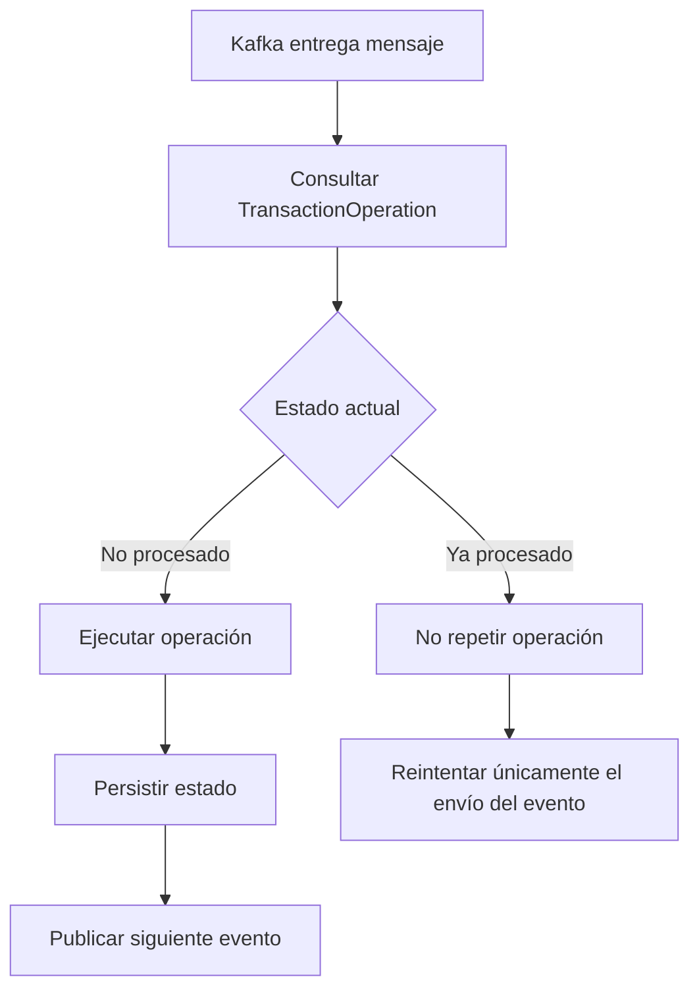
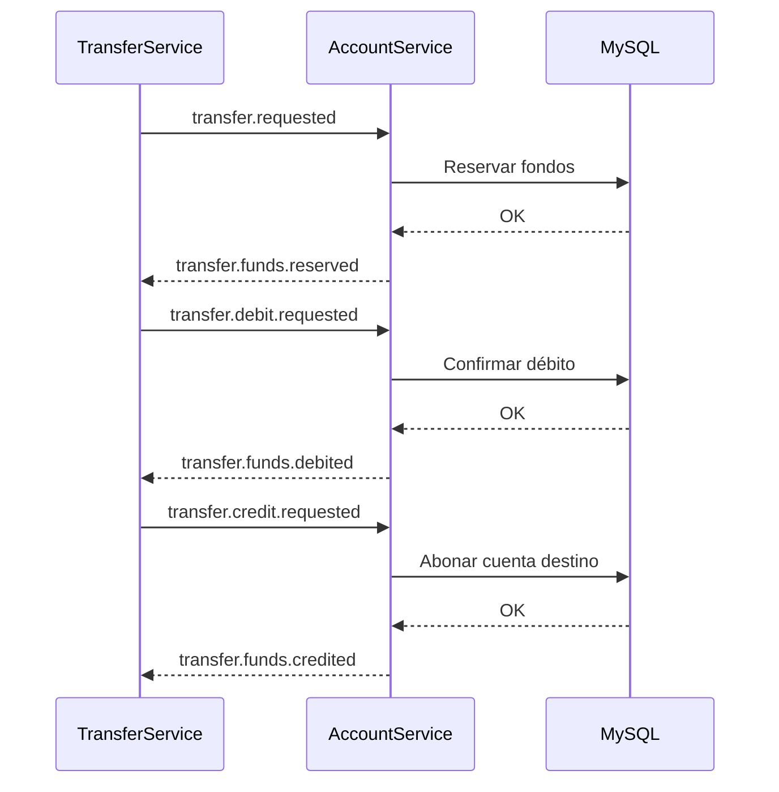

# Account Service

## Descripción

Account Service es el microservicio responsable de gestionar el dominio financiero de la plataforma. Además de mantener la información de las cuentas bancarias de los usuarios, participa activamente en el procesamiento de transferencias distribuidas garantizando la consistencia de los datos incluso ante fallos parciales, reintentos o errores de comunicación entre microservicios.

A diferencia de otros dominios de la aplicación, las operaciones financieras requieren un nivel de fiabilidad especialmente elevado. Mientras que determinados errores pueden ser aceptables en otros contextos, una modificación incorrecta del saldo de una cuenta supondría una pérdida de integridad del sistema.

Por este motivo, este servicio implementa mecanismos de consistencia transaccional, procesamiento idempotente, coordinación mediante eventos y compensaciones distribuidas, asegurando que cada operación financiera se ejecute una única vez y pueda recuperarse correctamente ante cualquier incidencia.

---

# Responsabilidades

Account Service concentra toda la lógica relacionada con la gestión financiera de la plataforma.

Entre sus principales responsabilidades se encuentran:

- Gestión de las cuentas bancarias de los usuarios.
- Creación automática de cuentas tras el alta de un nuevo usuario.
- Consulta de información financiera.
- Gestión de depósitos manuales para pruebas del sistema.
- Ejecución de operaciones financieras durante una transferencia.
- Reserva de fondos antes de confirmar una operación.
- Confirmación de débitos y créditos.
- Liberación o devolución de fondos durante compensaciones.
- Publicación y consumo de eventos mediante Apache Kafka.
- Garantizar la consistencia de las operaciones distribuidas.

---

# Problema que resuelve

Las transferencias bancarias implican modificaciones sobre varias entidades distribuidas y diferentes microservicios.

Una transferencia no consiste únicamente en descontar dinero de una cuenta y añadirlo en otra. Durante el proceso pueden producirse errores de red, caídas de servicios, reintentos automáticos o fallos de persistencia que deben gestionarse sin comprometer la integridad del sistema.

Para resolver este problema, Account Service actúa como responsable de todas las modificaciones sobre el estado financiero de las cuentas, mientras que la coordinación del proceso completo recae sobre Transfer Service mediante el patrón Saga.

Este enfoque permite desacoplar la lógica de negocio de la coordinación distribuida, manteniendo una clara separación de responsabilidades entre ambos servicios.

---

# Arquitectura

El servicio sigue una arquitectura por capas basada en Spring Boot.

```text
Controller
      │
      ▼
Application Services
      │
      ├──────────────┐
      ▼              ▼
AccountService   AccountTransferService
      │              │
      └──────┬───────┘
             ▼
Repositories
             ▼
MySQL
```

Las responsabilidades se encuentran claramente separadas.

### AccountService

Contiene toda la lógica relacionada con la gestión del dominio de cuentas:

- consultas
- depósitos
- reservas
- débitos
- créditos
- compensaciones
- acceso a persistencia

### AccountTransferService

Implementa el procesamiento de eventos relacionados con las transferencias distribuidas.

Su única responsabilidad consiste en coordinar la ejecución de cada operación financiera dentro de la Saga, delegando las modificaciones reales del dominio en AccountService.

Esta separación reduce el acoplamiento entre la lógica financiera y la infraestructura de mensajería, facilitando el mantenimiento y la evolución del sistema.

---

# Modelo de dominio

El dominio del servicio está compuesto principalmente por dos entidades.

## AccountDocument

Representa una cuenta bancaria dentro de la plataforma.

Cada cuenta mantiene información como:

- identificador del usuario
- número de cuenta
- saldo total
- saldo disponible
- saldo reservado
- moneda
- estado
- fecha de apertura

La separación entre saldo disponible y saldo reservado permite bloquear temporalmente fondos mientras una transferencia permanece en ejecución, evitando inconsistencias durante el procesamiento distribuido.

---

## TransactionOperation

Cada transferencia distribuida posee un identificador único (`transactionId`).

Esta entidad registra el estado alcanzado por una operación financiera dentro de Account Service.

Su objetivo no es almacenar un historial de operaciones, sino permitir que el servicio pueda recuperarse correctamente ante reintentos de Kafka.

Gracias a este mecanismo:

- una operación ya persistida nunca vuelve a ejecutarse;
- únicamente se reanudan los pasos pendientes;
- se evita la duplicación de modificaciones sobre el saldo;
- el servicio mantiene un comportamiento idempotente incluso tras fallos parciales.

Esta estrategia resulta especialmente importante cuando un error ocurre después de persistir una operación pero antes de publicar el siguiente evento de la Saga.

---

# Principales características

- Arquitectura basada en eventos.
- Persistencia relacional mediante MySQL.
- Gestión transaccional mediante `@Transactional`.
- Procesamiento idempotente de operaciones.
- Integración con Apache Kafka.
- Participación en el patrón Saga.
- Operaciones compensatorias.
- Dead Letter Topics (DLT).
- Correlation ID para trazabilidad distribuida.
- Observabilidad mediante Spring Actuator, Micrometer y Prometheus.
- Seguridad basada en JWT.

---

# Tecnologías utilizadas

| Tecnología | Uso |
|------------|-----|
| Java 25 | Lenguaje principal |
| Spring Boot 4 | Framework principal |
| Spring Security | Autenticación y autorización |
| Spring Data JPA | Persistencia |
| Hibernate | ORM |
| MySQL | Base de datos relacional |
| Apache Kafka | Comunicación asíncrona |
| Spring Kafka | Integración con Kafka |
| JWT | Autenticación |
| Docker | Contenedores |
| Kubernetes | Despliegue |
| Micrometer | Métricas |
| Prometheus | Monitorización |
| Grafana | Visualización |
| JUnit 5 | Testing |
| Mockito | Tests unitarios |

---

# Contenido del documento

Las siguientes secciones profundizan en cada uno de los aspectos anteriores:

- API REST
- Modelo de eventos
- Procesamiento de transferencias
- Consistencia financiera
- Gestión de operaciones distribuidas
- Saga y compensaciones
- Persistencia
- Observabilidad
- Testing
- Recursos adicionales

---

---

# API REST

Account Service expone una API REST orientada a la consulta y gestión de cuentas bancarias.

Las operaciones que modifican el estado financiero durante una transferencia no se realizan mediante llamadas HTTP entre microservicios, sino a través de eventos publicados en Apache Kafka. De esta forma, la API REST queda reservada para operaciones iniciadas directamente por clientes autenticados.

## Endpoints disponibles

| Método | Endpoint | Descripción | Seguridad |
|---------|----------|-------------|-----------|
| GET | `/api/v1/accounts/{userId}` | Obtiene la información de una cuenta bancaria. | ADMIN / USER |
| POST | `/api/v1/accounts/{userId}/deposit` | Realiza un ingreso manual sobre una cuenta. | ADMIN / USER |

### Consulta de cuenta

Permite obtener el estado actual de una cuenta bancaria a partir del identificador del usuario.

La respuesta incluye información como:

- número de cuenta
- saldo disponible
- saldo reservado
- moneda
- estado de la cuenta

### Depósito manual

Este endpoint ha sido incorporado como herramienta de apoyo para pruebas y demostraciones del sistema.

Permite simular ingresos sobre una cuenta sin necesidad de ejecutar una transferencia distribuida completa, facilitando la validación del resto de procesos del proyecto.

> **Nota**
>
> Las transferencias entre cuentas nunca utilizan este endpoint.
>
> Todas las operaciones financieras distribuidas son procesadas exclusivamente mediante eventos Kafka.

---

# Modelo de eventos

La comunicación entre microservicios sigue una arquitectura orientada a eventos.

Account Service actúa tanto como consumidor como productor de mensajes, participando en diferentes etapas del procesamiento distribuido de una transferencia.

## Eventos consumidos

| Evento | Origen | Acción |
|---------|--------|--------|
| `user.created` | UserAuthService | Creación automática de la cuenta bancaria del usuario. |
| `transfer.requested` | TransferService | Reserva de fondos. |
| `transfer.debit.requested` | TransferService | Confirmación del débito. |
| `transfer.credit.requested` | TransferService | Abono en la cuenta destino. |

## Eventos publicados

| Evento | Destino | Descripción |
|---------|---------|-------------|
| `transfer.funds.reserved` | TransferService | Fondos reservados correctamente. |
| `transfer.funds.reservation.failed` | TransferService | Error durante la reserva de fondos. |
| `transfer.funds.debited` | TransferService | Débito completado correctamente. |
| `transfer.funds.debit.failed` | TransferService | Error durante el débito. |
| `transfer.funds.credited` | TransferService | Crédito completado correctamente. |
| `transfer.funds.credit.failed` | TransferService | Error durante el crédito. |

## Flujo general de comunicación



La comunicación mediante eventos permite desacoplar los distintos microservicios de la plataforma, reduciendo dependencias directas y facilitando la recuperación ante fallos mediante reintentos y mecanismos de compensación.

---

# Procesamiento de transferencias

Account Service no inicia transferencias.

La coordinación completa del proceso corresponde a **Transfer Service**, que actúa como orquestador de la Saga.

Cuando se solicita una transferencia, este servicio recibe sucesivamente distintos eventos indicando qué operación financiera debe ejecutar en cada momento.

Cada operación modifica exclusivamente el estado financiero que le corresponde y, una vez completada correctamente, publica el siguiente evento para que la Saga pueda continuar.

## Flujo simplificado



Este modelo mantiene completamente desacopladas la coordinación de la transferencia y las modificaciones sobre el dominio financiero, permitiendo que ambos servicios evolucionen de forma independiente.

---

---

# Consistencia financiera

La principal responsabilidad de Account Service consiste en garantizar la integridad del estado financiero de las cuentas durante toda la ejecución de una transferencia distribuida.

En un sistema bancario no basta con que una operación termine correctamente en condiciones ideales. El sistema debe seguir siendo consistente incluso cuando se producen errores de red, interrupciones entre microservicios, reintentos automáticos o fallos de infraestructura.

Por este motivo, todas las modificaciones sobre el saldo de una cuenta se realizan dentro de transacciones de base de datos utilizando `@Transactional`.

Este enfoque garantiza que cada operación financiera sea atómica:

- todas las modificaciones se confirman conjuntamente;
- o bien ninguna de ellas llega a persistirse.

De esta forma se evita que una cuenta quede en un estado parcialmente actualizado debido a un fallo durante el procesamiento.

## Saldo disponible y saldo reservado

Una transferencia no descuenta inmediatamente el dinero de la cuenta origen.

Antes de confirmar el movimiento, el sistema realiza una **reserva temporal de fondos**.

Este mecanismo evita que un mismo saldo pueda utilizarse simultáneamente en varias transferencias mientras la operación continúa en ejecución.



Gracias a esta separación entre saldo disponible y saldo reservado, el sistema puede bloquear fondos temporalmente sin modificar todavía el balance definitivo de la cuenta.

Este comportamiento reproduce el funcionamiento habitual de muchas plataformas financieras y evita inconsistencias cuando varias operaciones intentan utilizar simultáneamente los mismos fondos.

---

# Gestión de operaciones distribuidas

En un sistema basado en mensajería, los consumidores de Kafka pueden procesar un mismo mensaje más de una vez debido a reintentos automáticos provocados por errores temporales.

Sin un mecanismo de control, este comportamiento podría provocar que una misma operación financiera modificase varias veces el saldo de una cuenta.

Para evitarlo, cada transferencia posee un identificador único (`transactionId`) que permite identificar la operación distribuida durante toda su ejecución.

Account Service mantiene una entidad denominada `TransactionOperation`, encargada de registrar el estado alcanzado por cada operación dentro del servicio.

Su objetivo principal no es almacenar un histórico de transacciones, sino proporcionar un mecanismo de **idempotencia** que permita recuperar la ejecución exactamente desde el punto en que se produjo un fallo.

## ¿Por qué es necesario?

Supongamos la siguiente situación.

```text
1. Se reservan correctamente los fondos.

2. La operación se persiste en MySQL.

3. El envío del evento Kafka falla.

4. Kafka realiza un nuevo intento.
```

Sin un control del estado, el servicio volvería a ejecutar toda la operación.

Como consecuencia, los fondos podrían reservarse dos veces.

Con `TransactionOperation` el comportamiento es diferente.

Antes de ejecutar cualquier modificación sobre el dominio financiero, el servicio consulta el estado actual de la operación.

Si dicha operación ya fue persistida correctamente, únicamente se reintenta el envío del evento pendiente, evitando repetir modificaciones que ya se realizaron con éxito.



Este mecanismo permite que los reintentos sean completamente seguros incluso cuando el fallo ocurre después de persistir la operación pero antes de completar la comunicación con el siguiente microservicio.

---

# Saga y compensaciones

Account Service participa como uno de los servicios ejecutores dentro de la Saga distribuida.

La coordinación completa de la transferencia corresponde a **Transfer Service**, que actúa como orquestador.

Cada vez que recibe un evento, Account Service ejecuta exclusivamente la operación financiera que le corresponde y publica el resultado para que la Saga continúe.



## Compensaciones

En una arquitectura distribuida no es posible realizar una única transacción que abarque todos los microservicios.

Cuando una operación falla después de haberse completado parcialmente, el sistema ejecuta operaciones compensatorias que revierten los efectos ya aplicados.

Por ejemplo:

- si el débito se realiza correctamente pero el crédito falla, los fondos son devueltos automáticamente a la cuenta origen;
- si una reserva de fondos no puede confirmarse, dicha reserva es liberada;
- si una operación no puede completarse tras varios intentos, el evento es enviado a una **Dead Letter Topic (DLT)** para su posterior análisis.

Este enfoque permite mantener la consistencia global de la plataforma sin necesidad de utilizar transacciones distribuidas entre microservicios.

La combinación de **Saga**, **compensaciones**, **reintentos**, **DLT** e **idempotencia** proporciona un modelo robusto capaz de recuperarse automáticamente de la mayoría de los fallos temporales sin comprometer la integridad de los datos financieros.

---

---

# Persistencia

Account Service utiliza una base de datos relacional (MySQL) para almacenar toda la información relacionada con las cuentas bancarias y el estado de las operaciones distribuidas.

La elección de una base de datos relacional responde a los requisitos de consistencia propios del dominio financiero.

A diferencia de otros dominios de la aplicación, donde la disponibilidad o la flexibilidad del modelo pueden tener mayor importancia, las operaciones sobre saldos requieren garantizar propiedades ACID que aseguren la integridad de los datos incluso ante fallos inesperados.

Las modificaciones sobre las cuentas se ejecutan mediante transacciones de base de datos utilizando `@Transactional`, garantizando que cada operación financiera sea completamente consistente antes de continuar con el siguiente paso de la Saga.

## Entidades principales

### AccountDocument

Representa una cuenta bancaria dentro del sistema.

Contiene toda la información necesaria para gestionar el estado financiero del usuario.


### TransactionOperation

Registra el estado alcanzado por cada operación distribuida dentro de Account Service.

---

# Observabilidad

Uno de los objetivos del proyecto consiste en facilitar la supervisión del comportamiento interno de la plataforma durante su ejecución.

Para ello, Account Service incorpora distintos mecanismos de observabilidad.

## Correlation ID

Cada petición HTTP incorpora un identificador único que acompaña a la operación durante todo su recorrido por la plataforma.

Este identificador también se propaga entre los diferentes eventos publicados en Kafka, permitiendo reconstruir el flujo completo de una transferencia distribuida a través de los distintos microservicios.

Gracias a ello resulta posible localizar rápidamente el origen de un problema durante tareas de monitorización o depuración.

## Spring Boot Actuator

El servicio expone información operativa mediante Spring Boot Actuator.

Entre otros, se encuentran disponibles los siguientes endpoints:

- Health
- Info
- Metrics
- Prometheus

Estos endpoints son utilizados posteriormente por Prometheus para la recopilación de métricas de la aplicación.

## Micrometer, Prometheus y Grafana

Las métricas generadas por el servicio son recogidas mediante Micrometer y expuestas en formato Prometheus.

Posteriormente pueden visualizarse mediante Grafana junto con el resto de microservicios de la plataforma, proporcionando una visión global del comportamiento del sistema.

---

# Testing

El proyecto incorpora diferentes niveles de pruebas con el objetivo de validar los componentes más relevantes del servicio.

No se busca alcanzar una cobertura completa, sino demostrar la aplicación de distintas estrategias de testing sobre aquellas áreas que presentan mayor criticidad funcional.

## Tests unitarios

Las pruebas unitarias verifican la lógica de negocio implementada en los servicios, aislando las dependencias mediante Mockito.

Entre ellas destacan:

- `AccountServiceImplTest`

## Tests de integración

Las pruebas de integración validan el comportamiento conjunto de distintos componentes de la aplicación.

En particular se comprueba:

- procesamiento de eventos Kafka;
- comunicación entre productores y consumidores;
- funcionamiento de las Dead Letter Topics (DLT).

Entre ellas destacan:

- `TransferKafkaIntegrationTest`
- `TransferKafkaDLTIntegrationTest`

## Context Load

También se incluye una prueba de carga del contexto de Spring Boot que verifica la correcta inicialización de la aplicación.

- `AccountServiceApplicationTest`

---

# Estado actual

Actualmente el servicio implementa todas las funcionalidades necesarias para participar en el procesamiento distribuido de transferencias dentro de la plataforma.

Entre las capacidades disponibles destacan:

- Gestión de cuentas bancarias.
- Consulta de información financiera.
- Depósitos manuales para pruebas.
- Creación automática de cuentas tras el alta de usuarios.
- Procesamiento de transferencias mediante eventos.
- Reserva de fondos.
- Confirmación de débitos.
- Confirmación de créditos.
- Operaciones compensatorias.
- Gestión idempotente de reintentos.
- Integración con Apache Kafka.
- Persistencia en MySQL.
- Observabilidad mediante Micrometer y Prometheus.
- Seguridad basada en JWT.

El servicio continúa evolucionando junto con el resto de la plataforma como parte del desarrollo progresivo de Banking Microservices.

---

## Documentación general

| Documento | Descripción |
|-----------|-------------|
| [README.md](README.md) | Visión general de la plataforma. |
| [ARCHITECTURE.md](ARCHITECTURE.md) | Arquitectura, principios de diseño y decisiones técnicas. |
| [EVENTS.md](EVENTS.md) | Comunicación mediante eventos, Kafka y patrón Saga. |
| [SECURITY.md](SECURITY.md) | Autenticación, autorización y seguridad con JWT. |


## Microservicios

| Servicio | Documentación |
|----------|---------------|
| API Gateway | [APIGATEWAY](APIGATEWAY.md) |
| User Authentication Service | [USERAUTHSERVICE](USERAUTHSERVICE.md) |
| Account Service | [ACCOUNTSERVICE](ACCOUNTSERVICE.md) |
| Transfer Service | [TRANSFERSERVICE](TRANSFERSERVICE.md) |
| Infrastructure | [INFRASTRUCTURE](INFRASTRUCTURE.md) |


Para comprender el flujo completo de una transferencia distribuida se recomienda consultar también la documentación del **Transfer Service**, responsable de la orquestación de la Saga.
